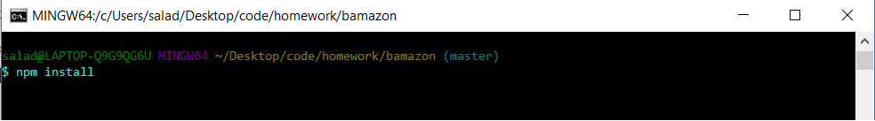

# Bamazon

Bamazon is a node app that imitates a retail inventory system. It has a customer app, a manager app, and a supervisor app that each provide more and more detailed information about the "store's" inventory and sales.

## Requirements
- [Node.js](https://nodejs.org/en/download/) 
- MySQL ([Windows](https://dev.mysql.com/downloads/windows/installer/8.0.html)) ([Mac](https://dev.mysql.com/downloads/mysql))
- [MySQL WorkBench](https://dev.mysql.com/downloads/workbench/)
- If you are on windows you will need [Gitbash](https://git-scm.com/downloads)

## Install
First you will need to open up Terminal (Mac) or Gitbash (Windows) and then navigate to the directory in which bamazon is installed. You will then need to enter the command 'npm install' like so.



Next you will need to go to the root directory of the bamazon install and create a folder called 'ignored'. Inside of that folder you will need to create a file called 'password.js'. The file will need to contain the following code with your own MySQL Server Password where it says 'Your password here'.

```JS
let secret = {
    password: 'Powerade.1'
}

module.exports = secret;
```
