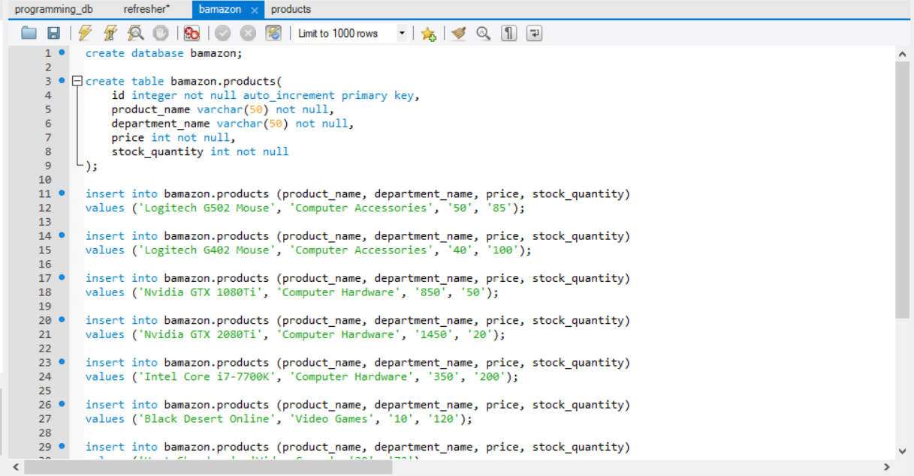

# Bamazon

Bamazon is a node app that imitates a retail inventory system. It has a customer app and a manager app that each provide more and more detailed information about the "store's" inventory and sales.

## Requirements
- [Node.js](https://nodejs.org/en/download/) 
- MySQL ([Windows](https://dev.mysql.com/downloads/windows/installer/8.0.html)) ([Mac](https://dev.mysql.com/downloads/mysql))
- [MySQL WorkBench](https://dev.mysql.com/downloads/workbench/)
- If you are on windows you will need [Gitbash](https://git-scm.com/downloads)

## Install
First you will need to open up Terminal (Mac) or Gitbash (Windows) and then navigate to the directory in which bamazon is installed. You will then need to enter the command 'npm install' like so.


Next you will need to go to the root directory of the bamazon install and create a folder called 'ignored'. Inside of that folder you will need to create a file called 'password.js'. The file will need to contain the following code with your own MySQL Server Password where it says 'Your password here'.

```JS
let secret = {
    password: 'Your password here'
}

module.exports = secret;
```

Next you will need to open up MySQL Workbench and open up 'bamazon.sql'. Run the file in order to generate the database.



## Starting The App
In order to start the app you will need to open up Terminal (Mac) or Gitbash (Windows) and navigate to the root directory of bamazon. You will then need to type 'node bamazonCustomer' or 'node bamazonManager' to open up each version of the app respectively.

## Customer App
When you initially open the customer app you will be shown a table of the products, their ID, their prices, amount in stock etc. In order to make a purchase you will need to enter the ID of the product that you want.


You will then need to enter quantity you would like to purchase. Make sure it is equal or less than the stock available. You will then be shown your order invoice with the total cost.


## Manager App
Upon opening the manager app you will be prompted with 4 question. Use the arrow keys to navigate the choices and hit enter to make a selection. 


View Prodcts will show you all the available stock just like the customer app. View low inventory will show you all the products that have a stock of less than 5.


Add to Inventory will allow you to add additional units to the stock of a currently existing product while Add New Product will allow you to add an entirely new product to the database.


